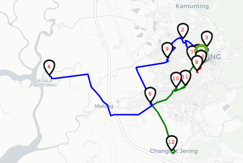

# The Travelling Salesman

Trip planning is not a new problem and it exists a very long time ago. Though origin unknown, the first travelling salesman problem can be traced back to the 1800s where there was a handbook describing an example tours through Germany and Switzerland. Nowadays in business, it is common to plan trip either to visit a customer or deliver goods. For example, your parcels delivered to your house from online shopping, the taxi drivers dropping people of at multiple locations at a time. To perform these tasks effectively and efficiently, we are often interest to find the best optimal route so that we can minimize the distance we trod and the time we spend.

> The travelling salesman problem asks the following questions: "Given the list of cities and the distances between each pair of cities, what is the shortest route that visits each city exactly once and returns to the origin city?"

## Problems

Route optimization is a common problem is business:

- For small business owner, if I have several orders to be delivered how can I do that efficiently?
- For business owner with fleet vehicle that handle logistics, how can the delivery route be planned efficiently?

## Solutions

Make use of [`openrouteservice.py`](https://github.com/keanteng/travelling-salesman) that provides an powerful method for route planning tasks. The solution is able to leverage map feature which is important for production usage.



Above show the example where I plan to deliver fried chicken from a restaurant to different locations around the districts with three vehicles.

## Run Locally

You need to create you API at [Open Route Service](https://openrouteservice.org/)

```py
git clone https://github.com/keanteng/travelling-salesman
```